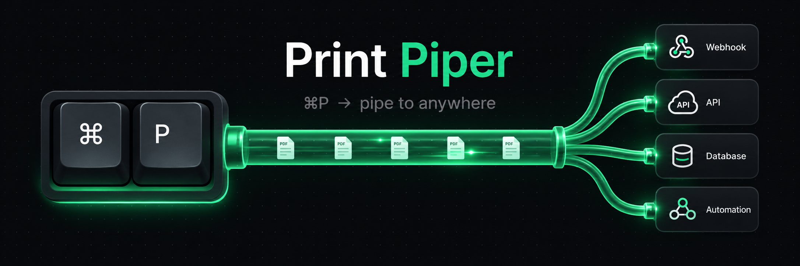
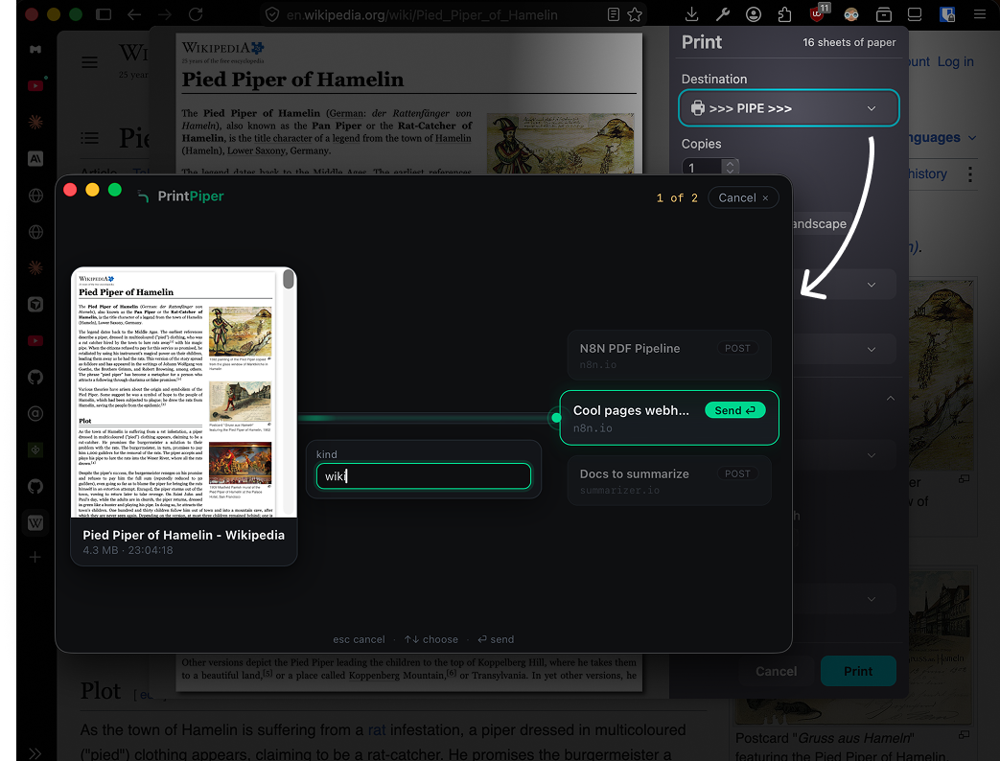

<p align="center">
  
</p>

<p align="center">
  
</p>

**A virtual printer for automators.** Hit ⌘P in any app, pick an endpoint, and your document lands in an API as a true vector PDF — no drivers, no cloud, no admin rights.

```
⌘P anywhere ──► "Print Piper" in the print dialog ──► picker window pops
                                                        │  PDF preview · endpoint list
                                                        ▼  click
                                              POST multipart/raw → your webhook
                                              (n8n, Zapier, Make, custom APIs, …)
```

## Download

**[Download the latest release →](https://github.com/notnavindu/print-piper/releases/latest)**

Latest: **v0.2.2**

| Platform | Download |
| --- | --- |
| macOS · Apple Silicon | [`Print.Piper_0.2.2_aarch64.dmg`](https://github.com/notnavindu/print-piper/releases/download/print-piper%400.2.2/Print.Piper_0.2.2_aarch64.dmg) |
| macOS · Intel | [`Print.Piper_0.2.2_x64.dmg`](https://github.com/notnavindu/print-piper/releases/download/print-piper%400.2.2/Print.Piper_0.2.2_x64.dmg) |
| Windows · x64 | [`Print.Piper_0.2.2_x64-setup.exe`](https://github.com/notnavindu/print-piper/releases/download/print-piper%400.2.2/Print.Piper_0.2.2_x64-setup.exe) |
| Windows · Arm64 | [`Print.Piper_0.2.2_arm64-setup.exe`](https://github.com/notnavindu/print-piper/releases/download/print-piper%400.2.2/Print.Piper_0.2.2_arm64-setup.exe) |

Builds are currently **unsigned**, so the first launch shows an "unverified developer" warning:

- **macOS** — right-click the app → **Open** → **Open** (once), or `xattr -dr com.apple.quarantine "/Applications/Print Piper.app"`.
- **Windows** — on the SmartScreen prompt, **More info** → **Run anyway**.

Then launch it and turn on **Launch at login** in Settings so `>>> PIPE >>>` is always in your print dialog. Print Piper checks for newer releases on launch and shows an in-app link when one is available.

## How it works

Print Piper is a single Tauri 2 app (Rust core, Svelte UI) that:

1. **Embeds an IPP server** (built on [`ippper`](https://github.com/ArcticLampyrid/ippper.rs)) and advertises itself over mDNS/DNS-SD as an IPP Everywhere printer — your OS's native print stack discovers it like any network printer. Zero driver code.
2. **Captures print jobs as vector PDF** (macOS spools PDF natively), preserving the document title, user, and fonts.
3. **Pops the pipe window** — the captured document on the left, a pulsating pipe in the middle, your endpoints on the right. The centered endpoint _latches onto_ the pipe; hit ⏎ (or click) and the PDF streams through (`multipart/form-data`, raw `application/pdf`, or GET trigger with metadata). Endpoints can declare **variables** (say, `name`) that you fill right in the pipe window — they ride along as form fields or query params.

Riding the industry's IPP convergence: Microsoft is deprecating third-party print drivers in favor of IPP (Windows Protected Print), so this architecture is aligned with where all desktop OSes are heading.

## Status

| Platform    | State                                                                                                                                                                                                                                                          |
| ----------- | -------------------------------------------------------------------------------------------------------------------------------------------------------------------------------------------------------------------------------------------------------------- |
| **macOS**   | ✅ Working end-to-end (discover → print → preview → dispatch) |
| **Windows** | ✅ Validated end-to-end via the [blind-test protocol](spec/06-packaging-windows-validation.md) |

Security defaults: capture is **loopback-only** (LAN printing is an explicit opt-in), spooled documents are pruned (50 jobs / 7 days), strict Tauri capabilities + CSP, asset protocol scoped to the spool dir only. Known gap: endpoint header values (API keys) live in a `0600` JSON file, not yet the OS keychain.

## Development

```sh
npm install
npm run tauri dev
```

The printer appears in your print dialog within seconds of launch ("Print Piper", port 63163 — configurable in Settings).

### Testing without printing

```sh
# conformance + inject a test job (macOS ships ipptool)
ipptool -t -f /usr/share/cups/ipptool/document-letter.pdf \
  ipp://localhost:63163/ipp/print print-job.test

# local echo endpoint to receive dispatches
python3 scripts/echo_server.py   # then add http://localhost:9999/hook as an endpoint
```

## Specs

Design lives in [`spec/`](spec/) — one slice per subsystem (capture, shell, endpoints, picker/dispatch, logs, packaging). Start with [`spec/00-overview.md`](spec/00-overview.md).

## Roadmap

- Packaging: signed/notarized `.dmg`, Windows installer via CI
- Endpoint secrets → OS keychain
